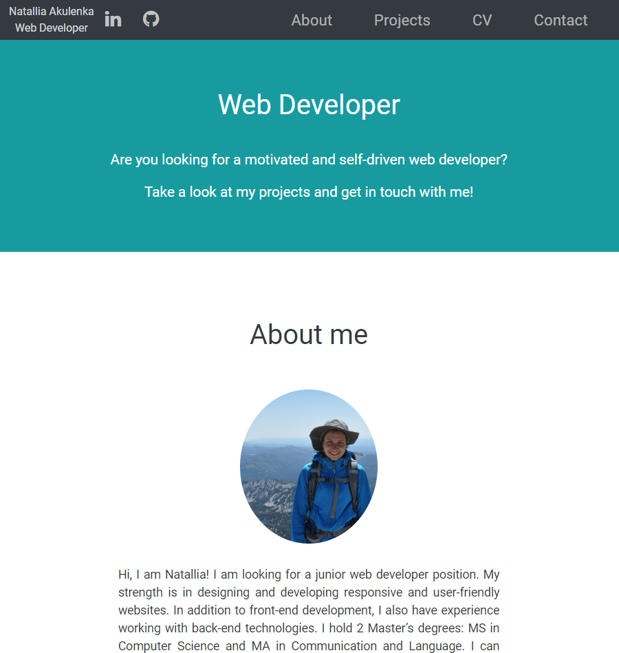
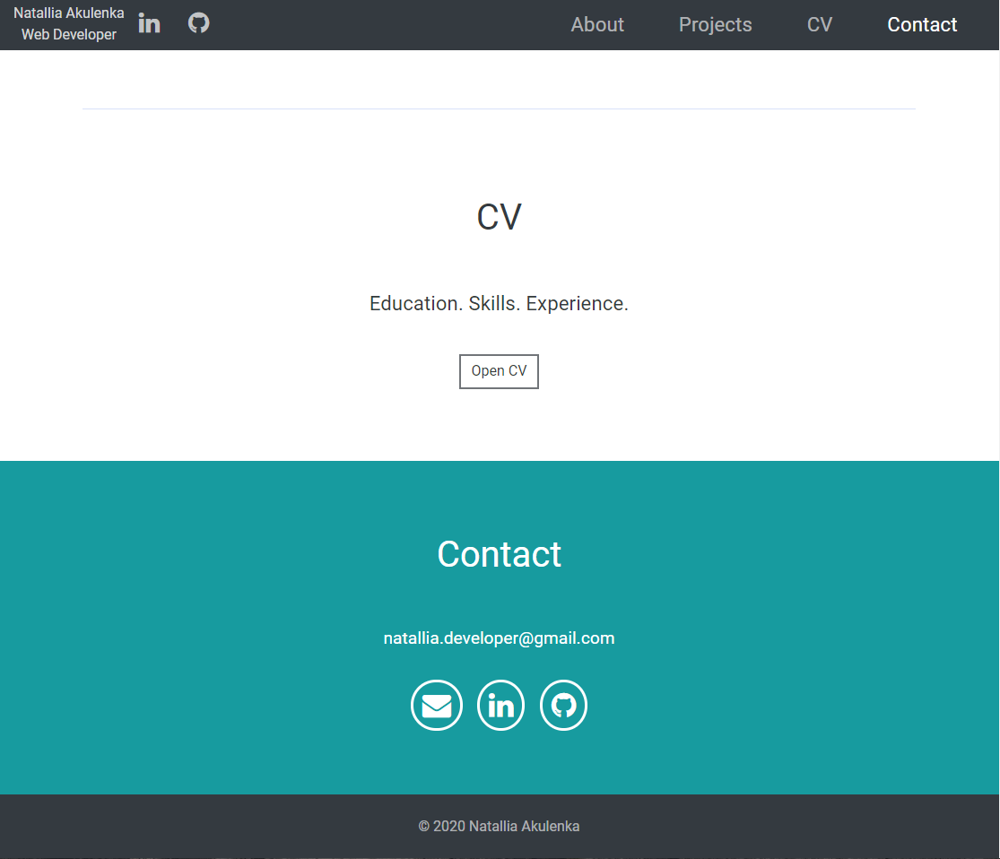
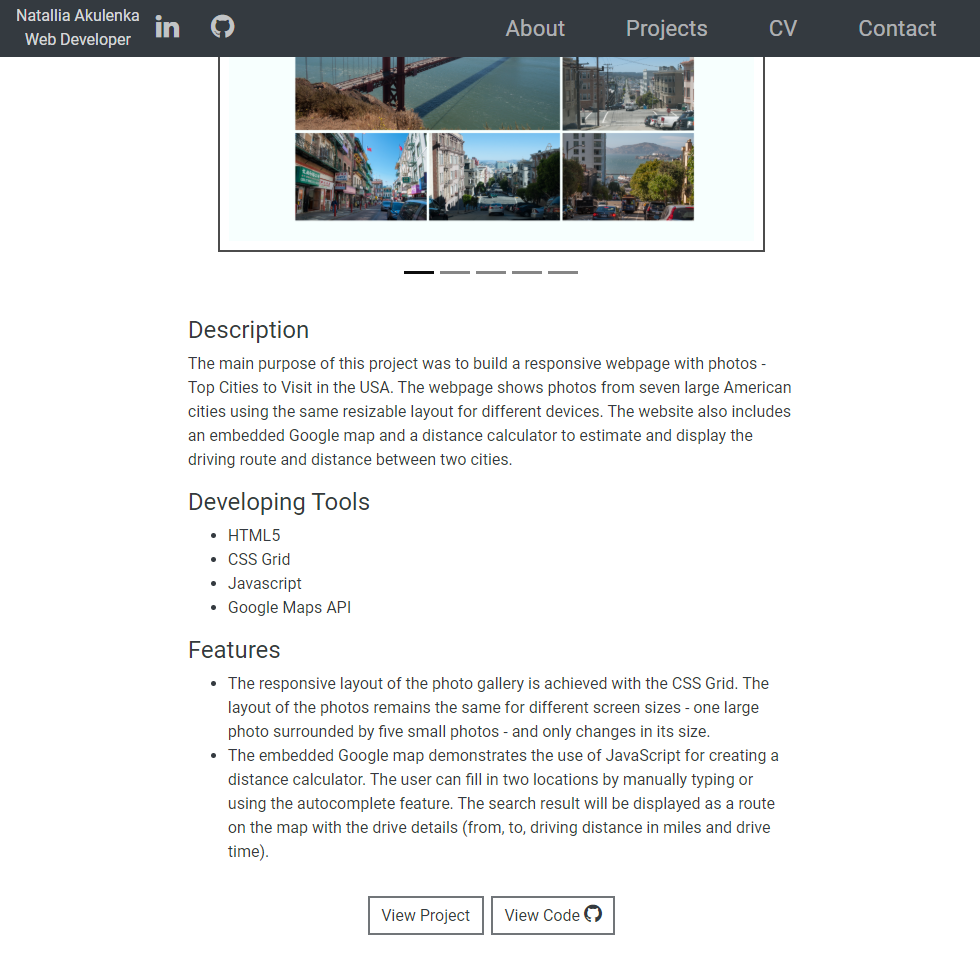

# Portfolio
Natallia's Portfolio Web Developer
<a src='https://natalliaa.github.io/'>Visit online</a>

Hi, I am Natallia! I am looking for a junior web developer position. My expertise is in designing and developing responsive and user-friendly websites. In addition to front-end development, I also have experience working with back-end technologies. I hold 2 Master’s degrees: MS in Computer Science and MA in Communication and Language. I can offer your team a different viewpoint from my former career in teaching Russian and German languages to diverse groups of all ages. My other passions include ultramarathons, photography, traveling, and meeting people from all over the world.

<h2>Tools</h2>

HTML, CSS, JavaScript, jQuery, Node.js, Express.js, MongoDB, Bootstrap, ASP.NET, C#, VB, SQL, third-party APIs, Java, Git, UML.

